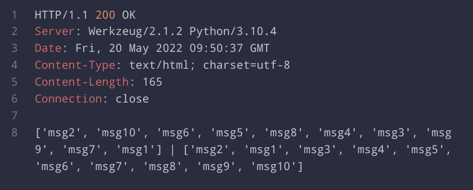

## Task 4

After launching a facade service, two instances of the message service and three logging services, we can send 10 POST requests:

These are the logs of the message services:

And the logs of the logging services:

And the GET request to the facade service, showing the results from the logging service and the message service:

