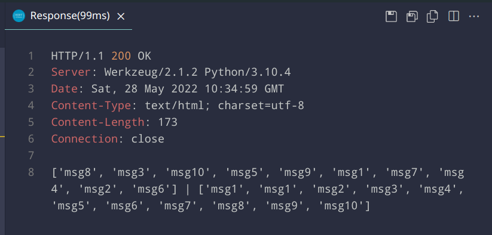
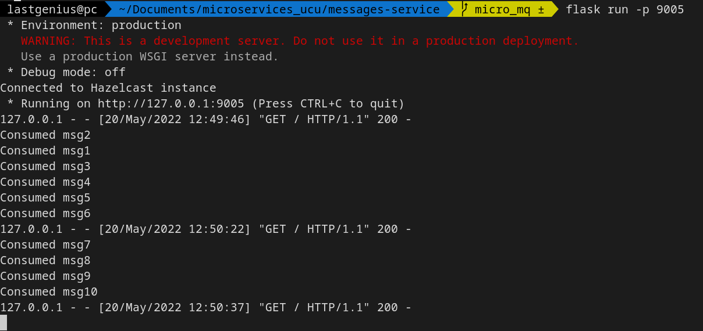
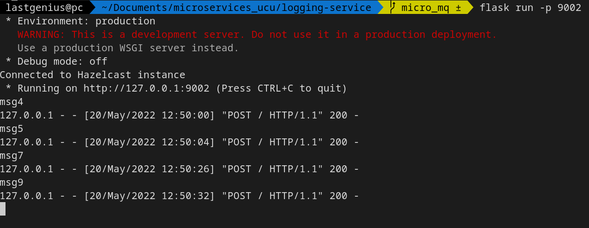
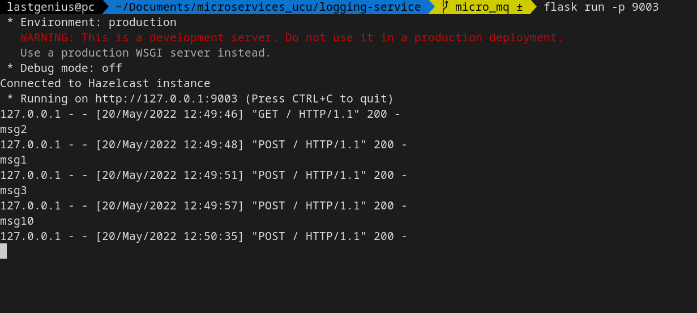
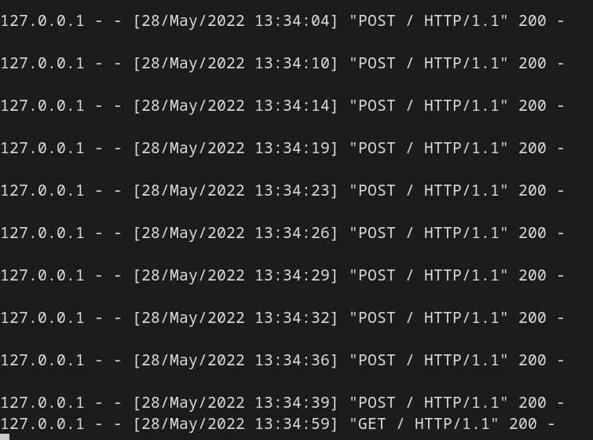

## Task 4

### Launching

We launched three Hazelcast nodes and one Consul instance:
```
bin/hz-start
consul agent -dev
```

After this, we setup Consul configuration:
```
bash setup_consul.sh
```

And launch three logging services, two message services and one facade service:
```
py logging_service -p {port}
py messages_service -p {port}
py facade_service
```

Once this is done, we can send GET and POST requests.

### Results

After sending 10 POST requests, we can observe the results with the GET request to the facade service



Only one message service received all the requests:


And the logs of three logging services, each receiving different requests:




Facade service logs:

