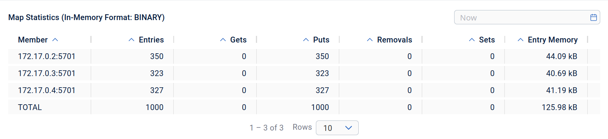
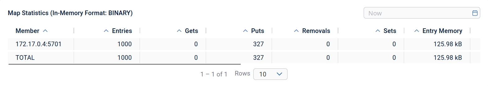

## Task 1

Installed Hazelcast

## Task 2

## Task 3

With all nodes present, data is spread roughly equally: 

With only two nodes present:

With only one node present:

As we can see, there is no loss of data and it's spread equally between the present nodes.

## Task 4

## Task 5 

Here is a blocked writer that has filled the queue, with no readers yet:

After launching two readers, they've unloaded the queue completely, taking different elements:

