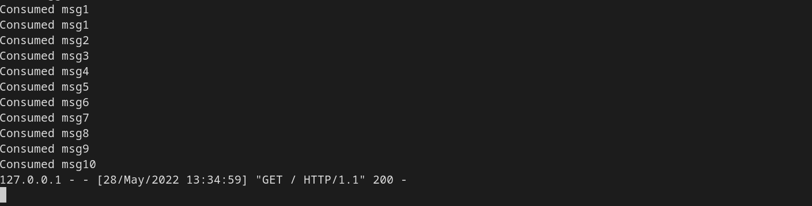
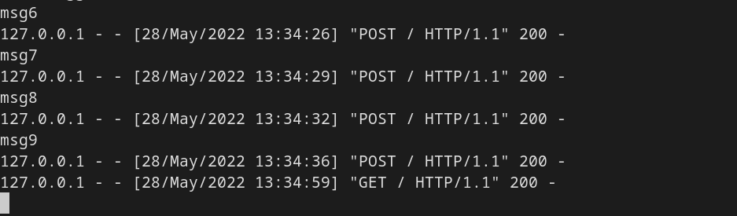
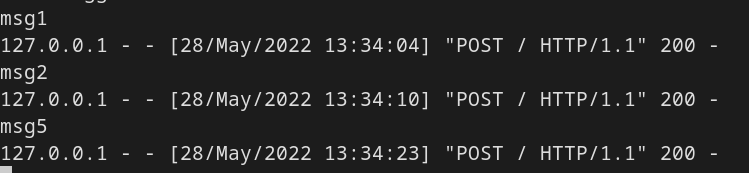
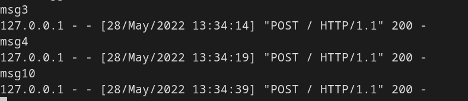

## Task 3

After launching one facade service, one messaging service and three logging services (connected to three Hazelcast nodes),
we can send messages through the facade service.

A GET request after all POST requests:

Since logging services are chosen randomly from a list by the facade service, each one
of them receives only several messages:

Since we are chosing logging services from a pre-defined list, we encounter errors
after suspending some of them, but we are still able to read messages from the remaining
Hazelcast nodes
